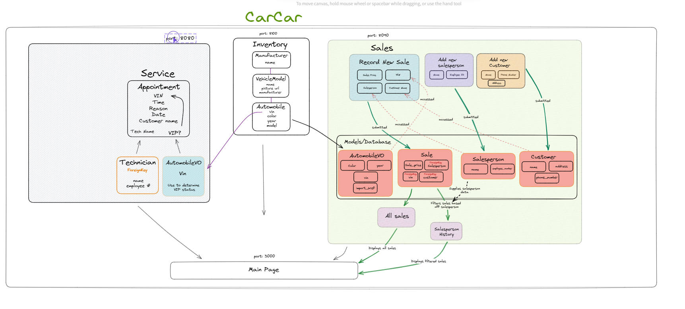

# CarCar

Team:

* Sofia Uribe - Service Microservice
* Jeff Chang - Sales Microservice


# Getting Started:


1. Make sure your Docker app is running
2. Clone this repository to your local computer (please replace “the repo” with the actual repository link)

```jsx
$ git clone <the repo>
```

1. **Make sure you are in the project directory**, then run these commands **one by one** in your terminal:

```jsx
docker volume create beta-data
docker-compose build
docker-compose up
```

When running `docker-compose up` on macOS, a warning about a missing environment variable named `OS` may appear. **You can safely ignore this warning!**

<aside>
Once everything loads, you can make your way to http://localhost:3000/ to check out the front end!

</aside>

## Overview of the microservices

### Inventory


### Service


The service microservice keeps track of service appointments for automobiles and their owners. More specifically, it enables customers to schedule service appointments, view appointment details, and review appointment history once an appointment is marked as "finished". The service history page includes a search function, allowing customers to easily find their vehicle by its VIN. This microservice polls the VIN data from the Inventory through a value object (named AutomobileVO here) to check if the vehicle qualifies for “VIP treatment”. Our dealership offers VIP treatment to customers who have purchased a vehicle from us.

The customer can also create a technician. This is visible when creating a new service appointment, as you select a technician in the form.

By utilizing states in the components, the database always contains the most up-to-date information for the objects; for example, when they are created, deleted, or updated.

### Sale


This sales microservice organizes the application to have all ‘sales’ related functions to be easily accessible by users. You can create a new customer, list all customers, list all sales, list all sales made by a specific salesperson, create a sale, create a salesperson and list all salespeople. The microservice will utilize the Automobile model in the Inventory directory and poll information from that file so it can stay updated. A built-in function that our ‘Create a Sale Form’ has is that the automobiles that show up in the automobiles drop-down list will only include cars that have not yet been sold. This functionality prevents any selling of duplicate cars (which have unique VINs).

## RestFUL APIs


### Inventory APIs:

| Action | Method | Url |
| --- | --- | --- |
| List manufacturers | GET | http://localhost:8100/api/manufacturers/ |
| Details of a manufacturer | GET | http://localhost:8100/api/manufacturers/<:id>/ |
| Create a manufacturer | POST | http://localhost:8100/api/manufacturers/ |
| Update a manufacturer | PUT | http://localhost:8100/api/manufacturers/<:id>/ |
| Delete a manufacturer | DELETE | http://localhost:8100/api/manufacturers/<:id>/ |
| ————————————————— | ——————— | ————————————————————————— |
| List Automobiles | GET | http://localhost:8080/api/automobiles/ |
| Details of an Automobile | GET | http://localhost:8080/api/automobiles/<:vin>/ |
| Create an Automobile | POST | http://localhost:8080/api/automobiles/ |
| Update an Automobile | PUT | http://localhost:8080/api/automobiles/<:vin>/ |
| Delete an Automobile | DELETE | http://localhost:8080/api/automobiles/<:vin>/ |
| ————————————————— | ——————— | ————————————————————————— |
| List Models | GET | http://localhost:8080/api/models/ |
| Details of an Model | GET | http://localhost:8080/api/models/<:id>/ |
| Create a Model | POST | http://localhost:8080/api/models/ |
| Update a Model | PUT | http://localhost:8080/api/models/<:id>/ |
| Delete a Model | DELETE | http://localhost:8080/api/models/<:id>/ |
| ————————————————— | ——————— | ————————————————————————— |

### Service APIs:

| Action | Method | Url |
| --- | --- | --- |
| List technicians | GET | http://localhost:8080/api/technicians/ |
| Details of a technician | GET | http://localhost:8080/api/technicians/<:id>/ |
| Create a technician | POST | http://localhost:8080/api/technicians/ |
| Update a technician | PUT | http://localhost:8080/api/technicians/<:id>/ |
| Delete a technician | DELETE | http://localhost:8080/api/technicians/<:id>/ |
| ————————————————— | ——————— | ————————————————————————— |
| List Appointments | GET | http://localhost:8080/api/appointments/ |
| Details of an appointment | GET | http://localhost:8080/api/appointments/<:id>/ |
| Create an appointment | POST | http://localhost:8080/api/appointments/ |
| Update an appointment | PUT | http://localhost:8080/api/appointments/<:id>/ |
| Delete an appointment | DELETE | http://localhost:8080/api/appointments/<:id>/ |
| ————————————————— | ——————— | ————————————————————————— |

### Sales APIs:

| Action | Method | Url |
| --- | --- | --- |
| List Salespeople | GET | http://localhost:8090/api/salespeople/ |
| Create a Salesperson | POST | http://localhost:8090/api/salespeople/ |
| ————————————————— | ——————— | ————————————————————————— |
| List Customer | GET | http://localhost:8090/api/customers/ |
| Create an Customer | POST | http://localhost:8090/api/customers/ |
| ————————————————— | ——————— | ————————————————————————— |
| List All Sales | GET | http://localhost:8090/api/sales/ |
| Salesperson History | GET | http://localhost:8090/api/salesperson/<:id>/sales |
| Create a Sale | POST | http://localhost:8090/api/sales/ |
| ————————————————— | ——————— | ————————————————————————— |

---

